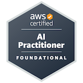
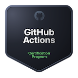

## Hi there 👋

If I were a resource, my deployment template would be:

```yaml
apiVersion: world/v1
kind: Person
metadata:
  name: Salva Manzanera
spec:
  replicas: 1 # There is only me!
  selector:
    matchLabels:
      app: goodGuy
  template:
    metadata:
      labels:
        role: leadArchitect
        company: NTTData
    spec:
      containers:
      - name: computeScience
        image: upv/computer-science-degree:2018
        ports:
        - containerPort: 8080
      - name: awsSolutionsArchitectAssociate
        image: aws/solutions-architect-associate:2024
        ports:
        - containerPort: 8081
```

### Things I am working on...
- Looking for the Workshop on Crossplane + ArgoCD? [See this repository](https://github.com/salvamiguel/crossplane-argocd-workshop)

## Badges

  
