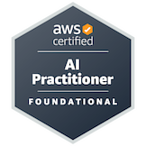
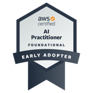
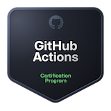
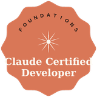

## Hi there 👋

If I were a resource, my deployment template would be:

```yaml
apiVersion: world/v1
kind: Person
metadata:
  name: Salva Manzanera
spec:
  replicas: 1 # There is only me!
  selector:
    matchLabels:
      app: goodGuy
  template:
    metadata:
      labels:
        role: expertArchitect
        company: NTTData
    spec:
      containers:
      - name: computeScience
        image: upv/computer-science-degree:2018
        ports:
        - containerPort: 8080
      - name: awsSolutionsArchitectAssociate
        image: aws/solutions-architect-associate:2024
        ports:
        - containerPort: 8081
      - name: awsAIPractitioner
        image: aws/ai-pratitioner:2025
        ports:
        - containerPort: 8082
      - name: githubActions
        image: github/actions:2025
        ports:
        - containerPort: 8083
      - name: azureAIFundamentals
        image: microsoft/azure-ai-fundamentals:2025
        ports:
        - containerPort: 8084
      - name: azureDataFundamentals
        image: microsoft/azure-data-fundamentals:2025
        ports:
        - containerPort: 8085
      - name: awsAcademyEducator
        image: aws/academy-educator:2026
        ports:
        - containerPort: 8086
      - name: claudeCertifiedArchitect
        image: anthropic/claude-certified-architect-foundations:2027
        ports:
        - containerPort: 8087
      - name: claudeCertifiedDeveloper
        image: anthropic/claude-certified-developer-foundations:2027
        ports:
        - containerPort: 8088
```

### Things I am working on...
- Looking for the Workshop on Crossplane + ArgoCD? [See this repository](https://github.com/salvamiguel/crossplane-argocd-workshop)
- Personal knowledge wiki for DevOps, Cloud & AI: [See materials](https://github.com/salvamiguel/materials)
- Need to test GitHub Actions declaratively with zero boilerplate? [See actions-test](https://github.com/salvamiguel/actions-test)

## Badges

        
